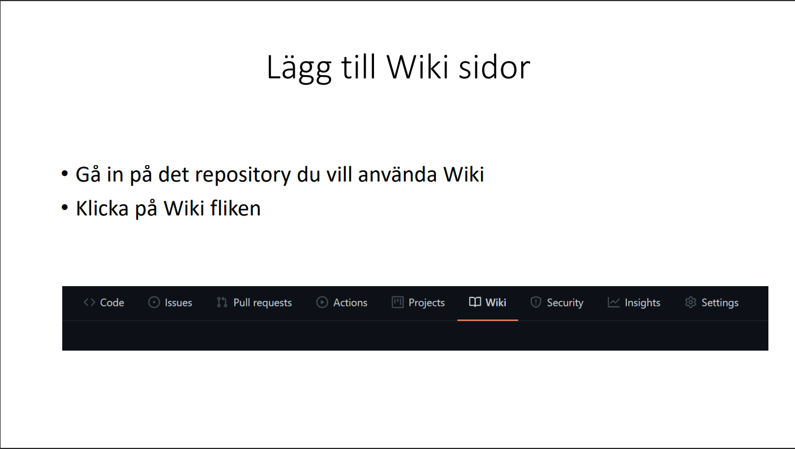

<h1>Ragnarök Readme.md</h1>
<h2>Testing</h2>
<h3>Unittesting</h3>
We decided to cover many of the components with unit tests, to make sure that they would return expected values.
We made many unit tests, to achieve a higher coverage.
<h3>Integration testing</h3>
We designed a few integration tests to make sure that we could follow a flow of either components, or how a user would interact with page. We were a bit limited in our integration testing since we did not have the time to research jest / react testing utils thoroughly and so these tests do not cover as much of the application as we would like it to.
The integration tests make sure that the search function calls the correct components, that the page renders with twelve pokemons and that the user gets search suggestions when entering a letter in the search box.
<h3>Sanity testing</h3>
We tried out much of the functionality of the page, and to make sure that there were no critical bugs. We tried to use the page as an user would, and fixed the issues we could find.
<h3>User Acceptance Testing</h3>
We invited a few persons to get their impressions about the page, and used their feedback for some improvements.

Information about GitHub Wiki

